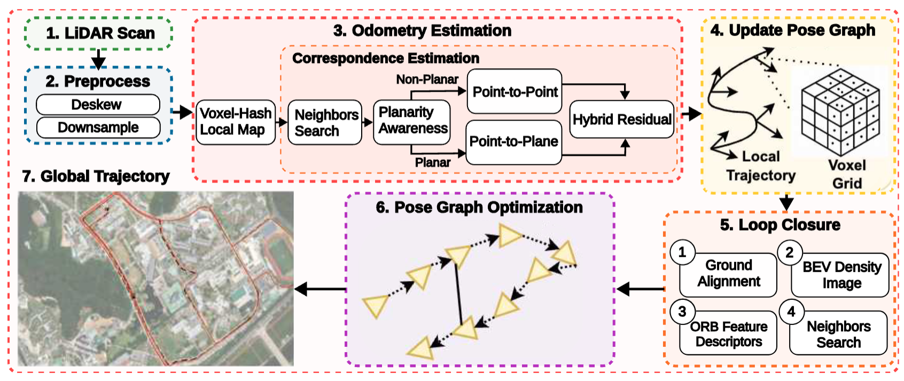

<div align="center">
    <h1>HP2-SLAM</h1>

[HP2-SLAM](https://github.com/cogniboticslab/hp2slam) is an Adaptive Hybrid ICP for Robust and Efficient LiDAR SLAM.

</div>

<hr />

<p align="center">
  
</p>


### Installation

For development purposes, we recommend creating a dedicated conda environment and installing all dependencies step by step:

```bash
# 1) Create and activate environment
conda create -n hp2slam python=3.9 -y
conda activate hp2slam

# 2) Install required system dependencies (Ubuntu/Debian)
sudo apt update
sudo apt install -y build-essential git python3-dev libeigen3-dev libsuitesparse-dev

# 3) Install Python build tools inside the environment
python -m pip install --upgrade pip
conda install -c conda-forge -y "cmake>=3.27" "ninja>=1.11"

# 4) Clone the repository
git clone https://github.com/cogniboticslab/hp2slam.git
cd hp2slam

# 5) Build & install the hybrid-icp dependency (vendored into this repo)
cd hybrid-icp/python
pip install -e .
cd ../..

# 6) Install hp2-slam itself in editable mode
pip install -e .

# 7) (Optional) Verify installation
python -c "import hybrid_icp; import hp2slam; print('Installation successful!')"

```

## Running the system
Next, follow the instructions on how to run the system by typing:
```
hp2slam_pipeline --help
```

This should print the following help message:


### Config
You can generate a default `config.yaml` by typing:

```
hp2slam_dump_config
```

which will generate a `hp2slam.yaml` file. Now, you can modify the parameters and pass the file to the `--config` option when running the `hp2slam_pipeline`.

Suggestion for indoor applications:
1. Reduce the `odometry.preprocessing.max_range` to 50.0, this will automatically reduce the `voxel_size` to 0.5.
2. Reduce the `local_mapper.splitting_distance` to a suitable distance based on the scale of the indoor environment.


## Citation
If you use this library for any academic work, please cite our original paper:
```bib

```

## Acknowledgements
This project builds on top of [KISS-SLAM](https://github.com/PRBonn/kiss-slam/), [KISS-ICP](https://github.com/PRBonn/kiss-icp), [MapClosures](https://github.com/PRBonn/MapClosures), and [g2o](https://github.com/RainerKuemmerle/g2o).


## Contact Us
For questions or feedback:
- GitHub Issues: https://github.com/cogniboticslab/hp2slam/issues
